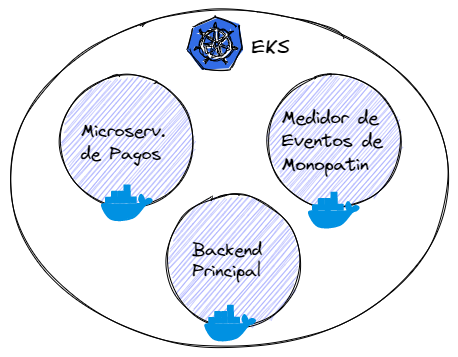
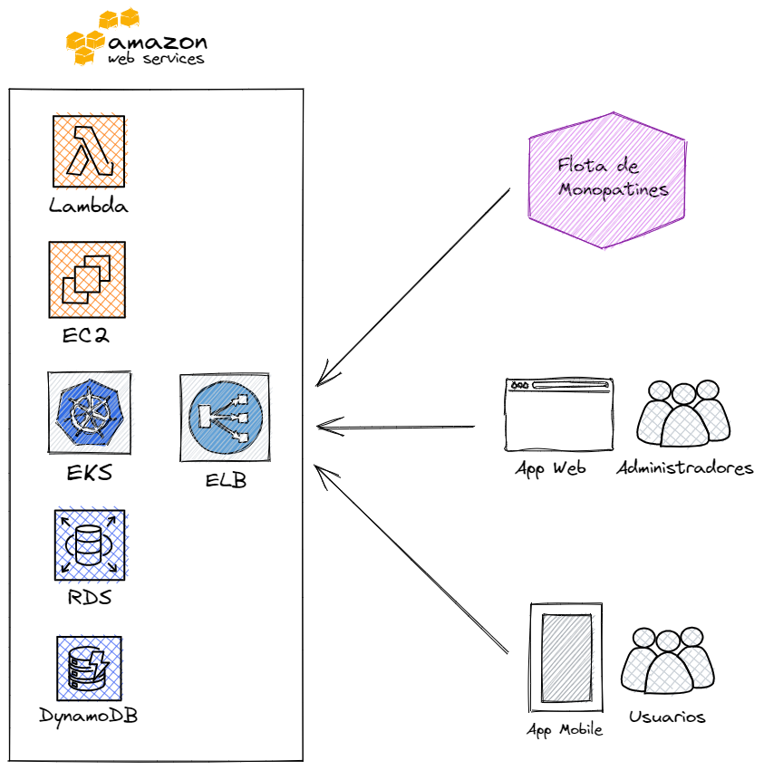
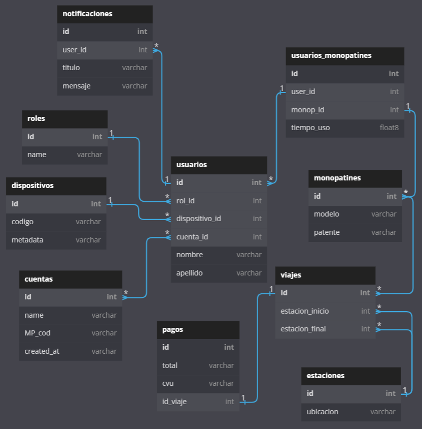
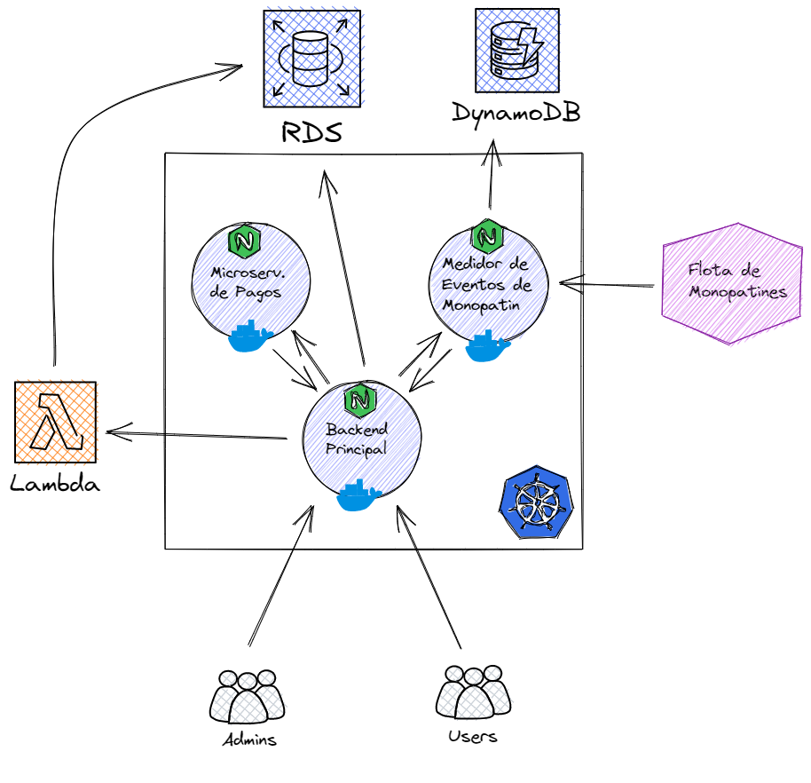

# Trabajo Práctico: Diseño de Arquitectura para Sistema de Monopatines Eléctricos

## Atributos más importantes:

- disponibilidad y performance.
- seguridad
- escalabilidad y desplegabilidad

## Decisiones que complacen las US y Requerimientos:

### Arquitectura principal:

Dado que lo que se requiere es que el sistema esté siempre activo y que sea rápido. Se optó por una arquitectura de microservicios basada en la nube.
Los tres microservicios principales serían: Backend Principal, Servicio de Pagos y Medidor de Eventos del Monopatín.
Se contrató un sistema en la nube de alta disponibilidad basado en microservicios en sus respectivos contenedores de Docker y estos siendo orquestados por Kubernetes (Amazon EKS - AWS).

Para la base de datos transaccional principal se utiliza PostgreSQL dentro del servicio RDS de AWS. Y para almacenar información de geolocalización de los monopatines se utiliza una base de datos NoSQL (DynamoDB de AWS).
Para desplegar el Frontend Principal (Aplicación web utilizada por los Encargados de Mantenimiento de monopatines) se utiliza EC2 de AWS.
Al frente de todo se utiliza un Load Balancer (ELB de AWS)
La aplicación mobile se sube a la AppStore de Apple y a la PlayStore de Android. Esta es descargada por los usuarios.
También se hace uso de Lambda Functions de AWS. Posteriormente se va a explicar el propósito de la utilización de este servicio.

La red se encarga constantemente de verificar la disponibilidad de cada monopatín con la funcionalidad de geolocalización del microservicio de Medidor de Eventos del Monopatín. Y ante la falta de disponibilidad de alguno, se toman acciones.

### Base de Datos

A continuación se presenta el diagrama de tablas existentes en la base de datos SQL.
Varios Usuarios están relacionados con una Cuenta. A su vez esta cuenta está relacionada con una cuenta de Mercado Pago.
Se crea una tabla “devices” que permite la utilización de distintos dispositivos en la aplicación.

A su vez, la base de datos NoSQL para geolocalización va a contener un registro de donde están los monopatines disponibles en el momento presente, o sea cada vez que un monopatín llega a un destino se crea un registro. Esta base de datos va a estar virtualmente relacionada a las tablas Monopatines y Estaciones de la base de datos transaccional principal.

### Patrones de Diseño y Funciones Importantes

Se utiliza JWT para autenticación (restful). Se envía el token en cada solicitud. Entre la app web, mobile, y el backend principal, no existen estados de sesiones (aplicación stateless).
Sí existe un estado de conexión entre en el microserv. de Medidor de Eventos del Monopatín y la flota de monopatines. Usando el patrón publish-subscribe implementado con websockets. Ya que los microservicios están construidos con Node.js. Se utiliza la librería Socket.IO.

La lógica del servicio que registra el monto a pagar por una cuenta hace la sumatoria del consumo de todos los usuarios en el momento:  
TOTAL MONTO CUENTA MP > PRECIO_SEG \* (SEG_U1 + SEG_U2 + … + SEG_UN)
También se configura un monto umbral ante el cual se informa al usuario que se está quedando sin tiempo de recorrido/saldo en su cuenta de mercadopago.
Se realiza también un cálculo de la estación más cercana a través de funciones Lambdas de AWS. Para que no deje iniciar viaje si el monto total de la cuenta de MP es menor al costo del tiempo estimado a la próxima estación.

### Desarrollo:

Para el desarrollo se usa github con github actions para ci/cd.
backend:

### Diseño principal:

## Escenarios y cómo las decisiones tomadas cumple los requerimientos:

Escenario 1:
siempre que se desee realizar tareas de mantenimiento se hace el pasaje al servidor alternativo contratado (ha)
gracias a la alta disp de los servidores cloud contratados, el mantenimiento cumple con la Medida de la respuesta, condición, dado que el load balancer del sistema se encarga de administrar las actualizaciones y pasajes entre sistemas productivos y alternativos

### Escenario 2:

gracias a los mecanismos de verificación de la red contratada la tasa de fallos causados por la conexión debido al estrés y congestión no supera el 5%

### Escenario 3:

en cuanto a red hardware:
Los monopatines están en el centro, y en el centro hay una red celular fuerte.
en cuanto a software:
ante una caída el restablecimiento de la conexión se realiza como si la conexión ya existiera, gracias JWT no requiere estado, no requiere que se establezca conexión en cada request enviada.
Gracias a kubernetes si cae el servidor se levanta automáticamente una nueva instancia

### Escenario 4:

El scheduler del load balancer se encarga de administrar la alta concurrencia utilizando distintas instancias del backend para cada cliente. Utilizando algún algoritmo de selección
Las decisiones tomadas anteriormente dan un tiempo de resp menor a un segundo porq tenemos varias instancias del backend trabajando simultáneamente, en paralelo
Se configura que se desplieguen tantas instancias como sean necesarias, si la red está congestionada se despliegan más, si no menos. Gracias a esto se alcanzan latencias inferiores a 2 seg en toda la traza desde que el usuario el botón de iniciar viaje hasta que el monopatín se enciende y queda listo para ser utilizado

### Escenario 5 y 6:

Gracias a la base de datos en tiempo real de geolocalización, que está en un sistema en paralelo, el tiempo de respuesta a la aplicación del lugar donde se encuentra cada monopatín. no mayor a 1 seg.
A su vez la detención del mismo es rápida ante una solicitud de pausa.

### Escenario 7:

Se cuenta con un servicio que se encarga de calcular la tarifa a pagar en función del tiempo utilizado. La misma se encarga de administrar la lógica con la plataforma de mercadopago para verificar que la cuenta cuente con el monto requerido

### Escenario 8:

La api de pagos realiza todo eso
El medidor de evento se encarga de registrar el monto consumido por un usuario de una cuenta , y si otro usuario de la misma cuenta empieza a consumir el servicio, se contempla en la suma. Todo eso se procesa en el servicio de medidor de eventos del monopatín.
Escalamiento vertical del servidor.

### Escenario 9:

Gracias al esquema de la base de datos diseñada. La misma soporta conexión concurrente en múltiples dispositivos asociados a la misma cuenta

### Escenario 10:

Calculamos costo del segundo y vamos restando a la cuenta la suma total de la utilización por usuario/segundo
Es satisfecho en la lógica del microserv que se encarga de calcular el monto a pagar.

### Escenario 11:

Gracias a la utilización de EKS AWS (kubernetes) se puede utilizar una nueva versión de la app y apuntar el proxy a la misma en muy pocos segundos.

### Escenario 12:

Gracias a la utilización de tecnologías de cloud computing, el escalado horizontal se hace de manera sencilla (Elastic Server).
